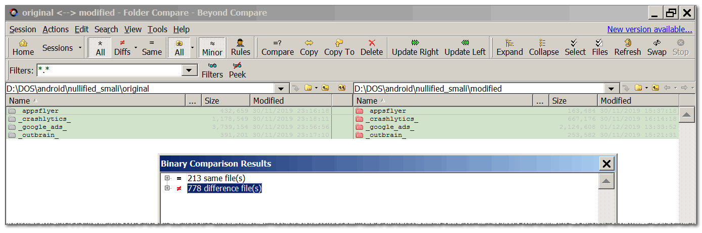
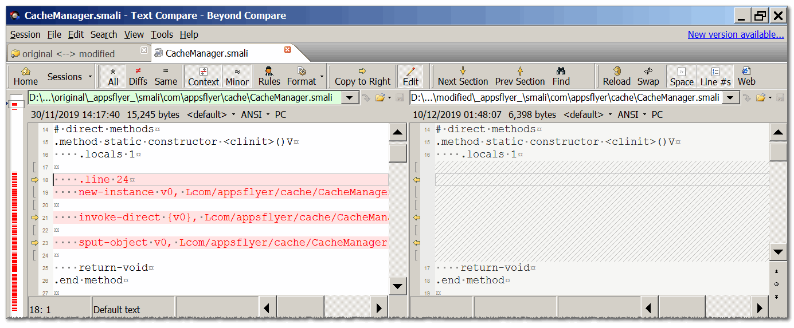
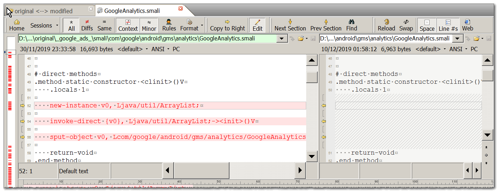

# nullified_smali
common libs that had their VOID method all-emptied (but the .locals and return-void lines) including constructors. This is a safe, easy and logic-less way of removing ads/analytics/reports/promotion'ed-content being used. After decompiling your APK with APKTool you can replace the folders with those here to minimalise/nullify the behavior of that lib. this was done manually :|

I've first done some of the files manually, 
considering that this results some errors, 
and different APKs will render different smali folders of the same libs, 
depanding on the amount of files packed in the archive, made the manual labor not so appealing, 
I've made a little NodeJS-client that backups, reads files and writes their nullified content, 
it is available in here: .

here are some diff.s:
  
  
  